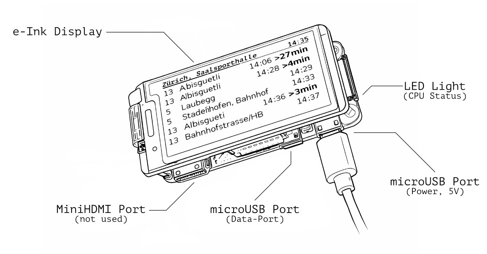

# OVBuddy

OVBuddy is a Swiss public transport departure display for Raspberry Pi with a Waveshare 2.13" e-ink screen.




## Quick start

### 1) Prepare the SD card

Option A (recommended): use the helper script (macOS-focused):

```bash
cd scripts
./setup-sd-card.sh
```

Optional non-interactive config:

```bash
cp env.example .env
# edit .env
```

### 2) Boot the Pi

Insert the SD card and power on. Wait ~5–6 minutes for first boot + automatic reboot.

You should see something like this when public transport lines have been configured.


### 3) Deploy OVBuddy

Create `.env` in the project root:

```bash
cat > .env <<'EOF'
PI_HOST=ovbuddy.local
PI_USER=pi
PI_PASSWORD=your_password
EOF
```

Then deploy:

```bash
cd scripts
./deploy.sh
```

Useful flags:
- `-main`: deploy `ovbuddy.py` (+ web UI assets) only
- `-reboot`: reboot after deploy and verify services

## Web interface (port 8080)

- **Normal network**: `http://ovbuddy.local:8080` (or `http://<pi-ip>:8080`)
- **AP fallback** (default): `http://192.168.4.1:8080`

### Web login (Basic Auth)

Credentials come from a plain text file on the Pi’s boot partition:
- **Path**: `/boot/firmware/ovbuddy-web-auth.txt` (newer images) or `/boot/ovbuddy-web-auth.txt` (older)
- **Default**: if missing/invalid, OVBuddy creates `admin` / `password`

## Configuration (`config.json`)

Primary settings live in `/home/<PI_USER>/ovbuddy/config.json` (stations, refresh interval, AP fallback, etc.). Defaults are shipped in `dist/config.json`.

## Documentation

- [`doc/SD_CARD_SETUP.md`](doc/SD_CARD_SETUP.md)
- [`doc/DEPLOYMENT.md`](doc/DEPLOYMENT.md)
- [`doc/WEB_INTERFACE.md`](doc/WEB_INTERFACE.md)
- [`doc/CONFIGURATION.md`](doc/CONFIGURATION.md)
- [`doc/TERMINAL_PREVIEW.md`](doc/TERMINAL_PREVIEW.md)
- [`doc/SIMULATOR.md`](doc/SIMULATOR.md)
- [`doc/TROUBLESHOOTING.md`](doc/TROUBLESHOOTING.md)
- [`doc/ZEROCONF_INSTALLATION.md`](doc/ZEROCONF_INSTALLATION.md)

